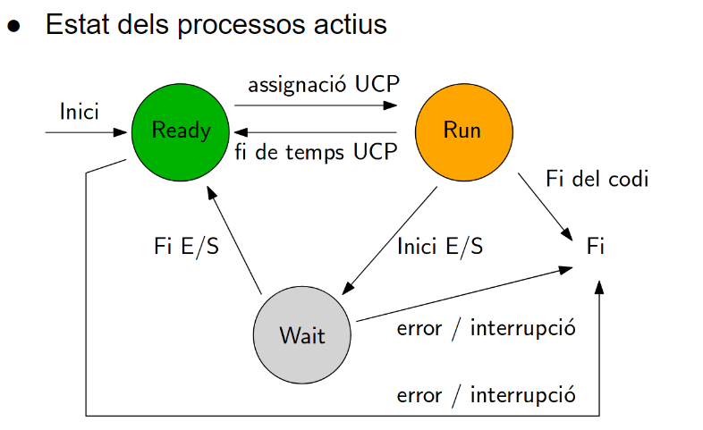

# Estats del Procés

Els processos passen per diversos estats durant el seu cicle de vida, i la comprensió d'aquests estats és essencial per a una gestió eficient:

1. **Nou (New):** En aquest estat, el procés està sent creat, però encara no s'ha iniciat la seva execució.

2. **Actiu (Ready):** Després de ser creat, el procés es mou a l'estat actiu. Està preparat per ser executat, però encara no ha obtingut l'accés a la CPU.

3. **En Execució (Running):** Quan el sistema operatiu assigna temps de CPU al procés, aquest passa a l'estat d'execució. És l'estat durant el qual el procés realitza les seves tasques.

4. **Bloquejat (Blocked):** Un procés pot passar a aquest estat quan espera per un esdeveniment (com ara l'entrada/sortida) que el permeti continuar la seva execució.

5. **En Espera (Waiting):** En aquest estat, el procés espera per un esdeveniment específic o per l'alliberament d'un recurs per part d'un altre procés.

6. **Completat (Terminated):** Quan el procés ha completat la seva execució, passa a aquest estat. Pot ser un estat final o pot ser seguit d'altres accions, com ara la recollida de recursos.

La gestió eficient implica controlar la transició entre aquests estats per optimitzar l'ús dels recursos del sistema.

## Transició d'estats

